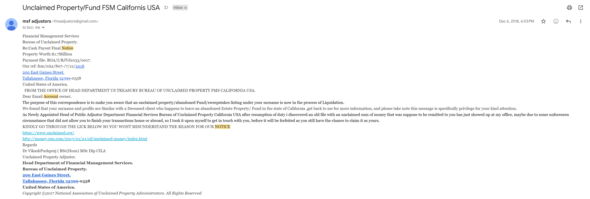
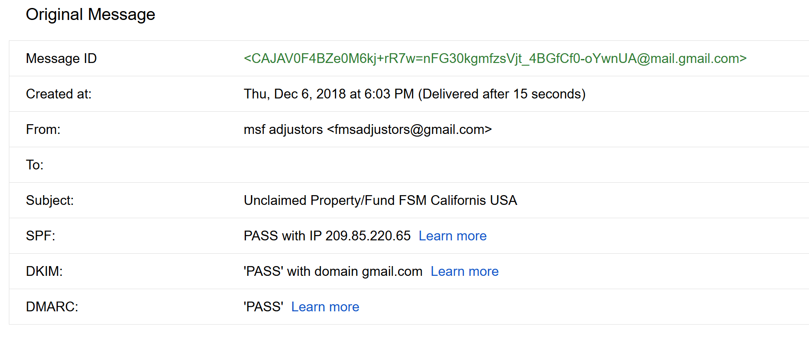
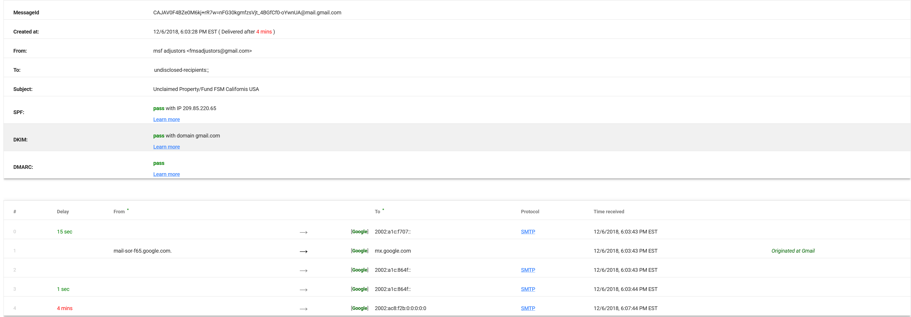
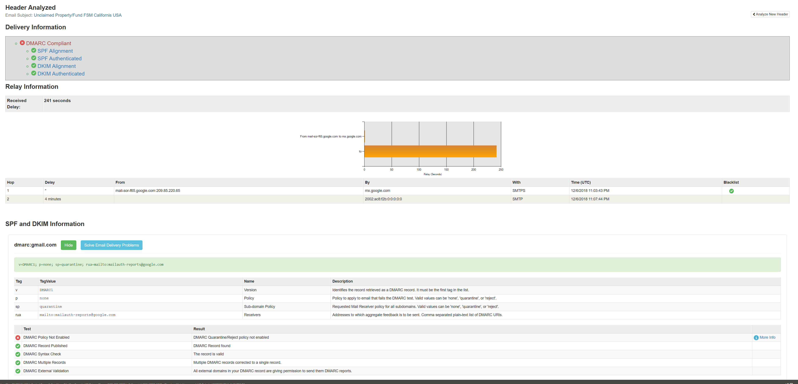
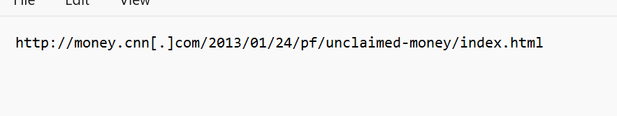
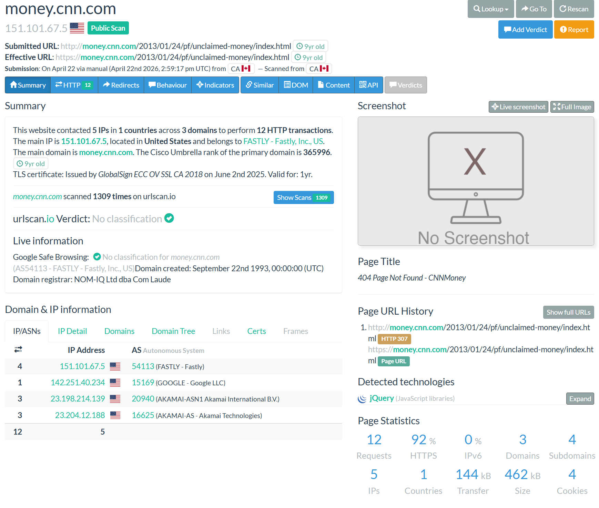
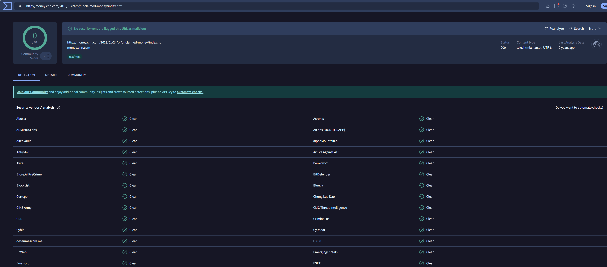
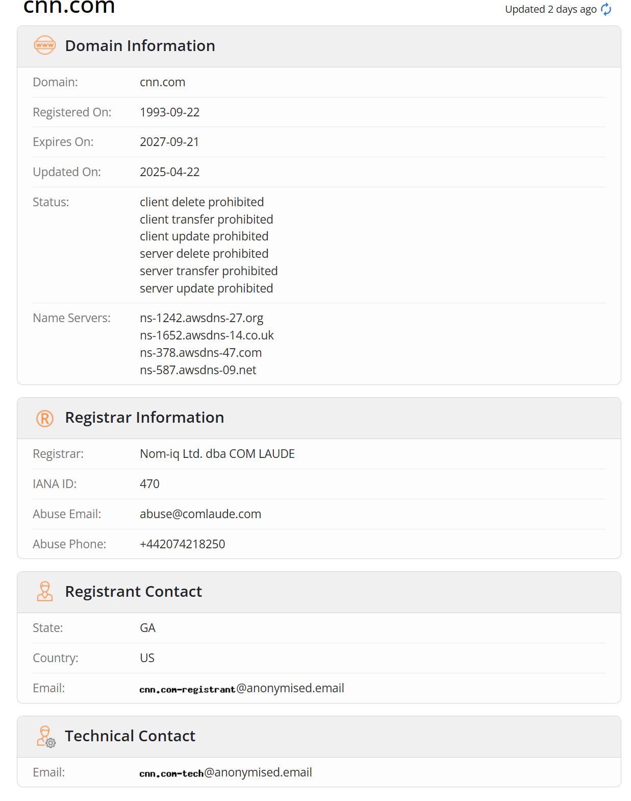

# Case 01: Unclaimed Property / Fund Phishing Email Investigation

## Objective

Analyze a suspicious email claiming to be related to an unclaimed property/fund payout and determine whether it is legitimate, suspicious, or phishing. The investigation focused on sender details, message content, email authentication results, suspicious links, domain reputation, and social engineering indicators.

## Scenario Summary

A suspicious email was received with the subject line **“Unclaimed Property/Fund FSM Califorins USA.”** The message claimed that the recipient may be entitled to an unclaimed fund/property payout worth **$1.7 million** and encouraged the recipient to review links related to unclaimed property.

The email appeared to impersonate a government or financial authority by referencing the **US Treasury**, **Bureau of Unclaimed Property**, and **Financial Management Services**. However, the message was sent from a personal Gmail account and contained several red flags, including poor grammar, unrealistic financial claims, unclear sender identity, and pressure to review external links.

## Tools Used

- Gmail Show Original
- Google Messageheader Analyzer
- MXToolbox Header Analyzer
- VirusTotal
- URLScan.io
- WHOIS lookup
- Manual email content review

## Email Summary

| Field | Finding |
|---|---|
| Subject | Unclaimed Property/Fund FSM Califorins USA |
| Sender Display Name | msf adjustors |
| Sender Email Address | fmsadjustors@gmail[.]com |
| Recipient Field | BCC / undisclosed recipients |
| Date Received | Dec 6, 2018 |
| Suspicious Link Present | Yes |
| Attachment Present | No visible attachment |
| Claimed Organization | Financial Management Services / Bureau of Unclaimed Property / US Treasury |
| Claimed Payout Amount | $1.7 million |

## Header Analysis

| Check | Result |
|---|---|
| SPF | Pass |
| DKIM | Pass with domain gmail.com |
| DMARC | Pass |
| Sender Alignment | Aligned with Gmail, not with the claimed government/financial organization |
| Sending IP | 209.85.220.65 |
| Suspicious Relay | No major suspicious relay identified from the header tools |

## Important Header Observation

The email passed SPF, DKIM, and DMARC checks because it was sent through Gmail infrastructure. However, this does **not** prove the email content is legitimate. It only shows that the sender was allowed to send mail using the Gmail account.

The main concern is that the email claims to represent a government/financial department, but the sender address is a personal Gmail account:

`fmsadjustors@gmail[.]com`

A legitimate government or financial services message would normally come from an official organizational domain, not a free Gmail address.

## Suspicious Links Identified

The email contained links related to unclaimed property and a CNN Money page.

| Link | Notes |
|---|---|
| hxxps://www.unclaimed[.]org/ | Link displayed in the email |
| hxxp://money.cnn[.]com/2013/01/24/pf/unclaimed-money/index.html | Link reviewed using URLScan and VirusTotal |

## URL / Domain Analysis

### URLScan Result

| Field | Finding |
|---|---|
| Submitted URL | hxxp://money.cnn[.]com/2013/01/24/pf/unclaimed-money/index.html |
| Effective URL | hxxps://money.cnn[.]com/2013/01/24/pf/unclaimed-money/index.html |
| Domain | money.cnn[.]com |
| Main IP | 151.101.67.5 |
| URLScan Verdict | No classification |
| Page Title | 404 Page Not Found - CNNMoney |
| HTTP Status | 307 redirect shown in page URL history |
| Notes | The scanned URL did not show an active malicious page, but it was used inside a suspicious email message. |

### VirusTotal Result

| Field | Finding |
|---|---|
| URL Checked | hxxp://money.cnn[.]com/2013/01/24/pf/unclaimed-money/index.html |
| Detection Result | 0/91 vendors flagged the URL as malicious |
| Status | 200 |
| Content Type | text/html |
| Notes | No security vendors flagged the URL, but the email content and sender behavior remain suspicious. |

### WHOIS Result

| Field | Finding |
|---|---|
| Domain | cnn.com |
| Registered On | 1993-09-22 |
| Expires On | 2027-09-21 |
| Registrar | Nom-iq Ltd. dba COM LAUDE |
| Notes | The CNN domain itself appears legitimate. The phishing concern comes from the email’s impersonation and social engineering, not necessarily from this domain. |

## Social Engineering Indicators

- The email claims the recipient may be owed **$1.7 million**, which is an unrealistic and high-value financial lure.
- The message impersonates official-sounding organizations such as **US Treasury**, **Bureau of Unclaimed Property**, and **Financial Management Services**.
- The sender uses a personal Gmail account instead of an official government or financial organization domain.
- The subject contains spelling mistakes, including **“Califorins”** instead of **California**.
- The message contains awkward wording, grammar mistakes, and unusual formatting.
- The email was sent using BCC/undisclosed recipients, which may indicate bulk sending.
- The message attempts to create urgency by suggesting the funds could be forfeited.
- The sender identity does not match the claimed authority in the body of the email.

## Indicators of Compromise

| Type | Indicator |
|---|---|
| Email Address | fmsadjustors@gmail[.]com |
| URL | hxxp://money.cnn[.]com/2013/01/24/pf/unclaimed-money/index.html |
| Domain | money.cnn[.]com |
| Domain | unclaimed[.]org |
| Sending IP | 209.85.220.65 |

## Evidence Screenshots

## Verdict

**Suspicious / Likely Phishing**

## Reasoning

Although the email passed SPF, DKIM, and DMARC authentication checks, those results only confirm that the message was sent through Gmail correctly. They do not confirm that the sender is a legitimate representative of a government or financial organization.

The email is suspicious because it claims to represent official agencies while using a personal Gmail address. It also uses a high-value financial lure, poor grammar, vague authority claims, and pressure to take action. The scanned CNN URL was not flagged as malicious by VirusTotal and did not show a malicious classification in URLScan, but the overall email context strongly matches common phishing and advance-fee scam patterns.

## Recommended Response

- Do not reply to the sender.
- Do not provide personal information, banking details, or identification documents.
- Do not click any links from the email.
- Report the email as phishing/spam.
- Block the sender if necessary.
- Search for similar emails sent to other users.
- If a user interacted with the email, review account activity and reset credentials as a precaution.

## Lessons Learned

This case shows that email authentication results such as SPF, DKIM, and DMARC are important, but they do not always prove that an email is safe. A phishing email can pass authentication if it is sent from a real email provider account. Analysts must review both technical indicators and message content, including sender identity, link behavior, social engineering tactics, and whether the sender domain matches the claimed organization.
