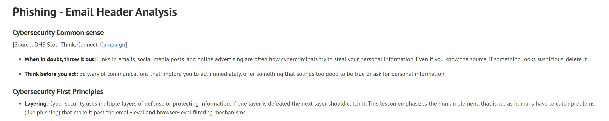
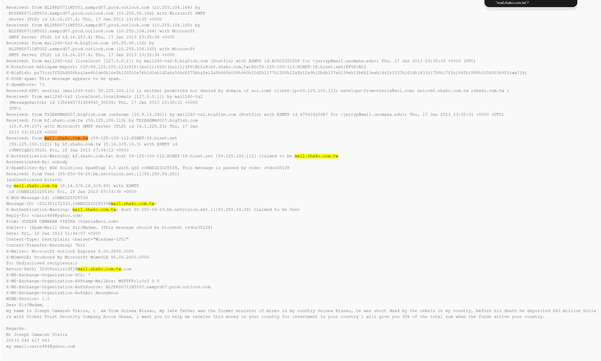
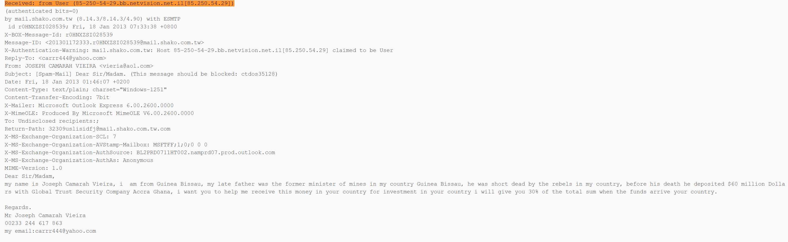
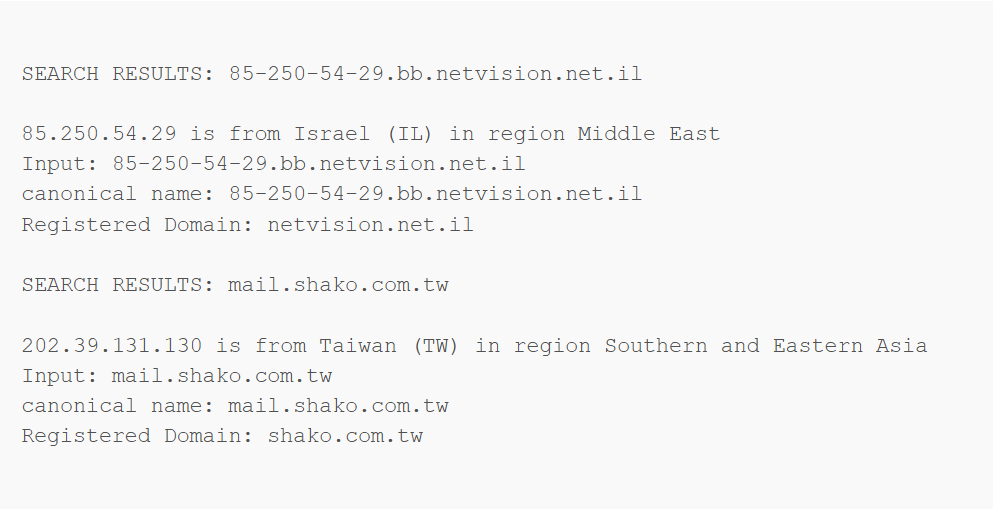
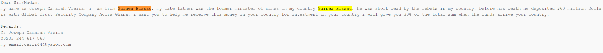
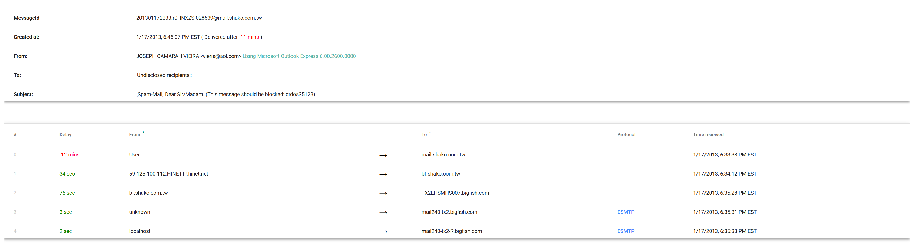

# Case 02: Advance-Fee Scam Email Header Analysis

## Objective

Analyze a suspicious email header from a public cybersecurity training exercise to identify phishing indicators, suspicious sender details, routing inconsistencies, spam indicators, and social engineering tactics.

## Scenario Summary

This case uses a public Nebraska GenCyber email header analysis exercise. The sample email appears to be an advance-fee scam where the sender claims to have access to a large amount of money and asks the recipient for help receiving the funds.

The investigation focused on reviewing the raw email header, identifying sender mismatches, tracing the email route, reviewing spam indicators, and analyzing the message body for social engineering techniques.

## Source

Nebraska GenCyber Email Header Analysis training exercise.

## Tools Used

- Nebraska GenCyber email header sample
- Google Messageheader Analyzer
- Manual email header review
- Email route analysis
- Social engineering analysis
- Screenshot documentation

## Email Summary

| Field | Finding |
|---|---|
| Subject | `[Spam-Mail] Dear Sir/Madam.` |
| From | `JOSEPH CAMARAH VIEIRA <vieria@aol[.]com>` |
| Reply-To | `carrr444@yahoo[.]com` |
| Return-Path | `32309uslisidfj@mail.shako.com.tw[.]com` |
| Recipient | Undisclosed recipients |
| Mail Client | Microsoft Outlook Express 6.00.2600.0000 |
| Claimed Sender Location | Guinea Bissau |
| Financial Lure | $60 million |
| Promised Reward | 30% of the total sum |

## Header Analysis

| Check | Finding |
|---|---|
| SPF | Neutral |
| X-SpamScore | 73 |
| Reply-To Match | No |
| Return-Path Match | No |
| Undisclosed Recipients | Yes |
| Suspicious Sender Routing | Yes |
| Suspicious Mail Client | Yes |

## Technical Findings

The email header shows several suspicious indicators. The visible `From` address claims to be from an AOL account, while the `Reply-To` address uses a Yahoo account. The `Return-Path` is different from both of those addresses and uses a suspicious-looking mail domain.

The email was sent to **undisclosed recipients**, which may indicate bulk or spam-style delivery. The message also has a high spam score of **73**, and the SPF result is **neutral**, meaning the sender was neither clearly authorized nor clearly blocked by the domain’s SPF policy.

The routing details also show suspicious location inconsistencies. The email body claims the sender is from **Guinea Bissau**, but the technical routing evidence shows activity involving an origin host associated with **Israel** and a mail server associated with **Taiwan**. This mismatch between the claimed identity and technical origin increases suspicion.

## Routing Evidence

| Field | Finding |
|---|---|
| Origin Host | `85-250-54-29.bb.netvision.net.il` |
| Origin IP | `85.250.54[.]29` |
| Origin Location | Israel |
| Mail Server | `mail.shako.com.tw` |
| Mail Server Location | Taiwan |
| Additional IP Shown | `202.39.131[.]130` |

## Social Engineering Indicators

- The email uses a generic greeting: **“Dear Sir/Madam.”**
- The sender claims access to **$60 million**, which is a common financial scam lure.
- The sender offers the recipient **30%** of the total amount.
- The message asks the recipient to help receive money in another country.
- The sender uses a dramatic story involving a deceased father and political conflict.
- The email includes poor grammar and unusual wording.
- The sender identity does not match the technical email routing details.
- The message asks for trust and cooperation without any legitimate verification.

## Indicators of Compromise

| Type | Indicator |
|---|---|
| From Email | `vieria@aol[.]com` |
| Reply-To Email | `carrr444@yahoo[.]com` |
| Return-Path | `32309uslisidfj@mail.shako.com.tw[.]com` |
| Origin Host | `85-250-54-29.bb.netvision.net.il` |
| Origin IP | `85.250.54[.]29` |
| Mail Server | `mail.shako.com.tw` |
| Mail Server IP | `202.39.131[.]130` |
| Spam Score | `73` |

## Evidence Screenshots

## Verdict

**Phishing / Spam**

## Reasoning

This email should be treated as phishing/spam because it contains multiple technical and content-based indicators of suspicious activity. The `From`, `Reply-To`, and `Return-Path` values do not match, which suggests the sender identity is not trustworthy. The message was sent to undisclosed recipients, has a high spam score, and uses classic advance-fee scam language involving a large promised payout.

The email body claims the sender is from Guinea Bissau, but the routing analysis shows technical infrastructure associated with other locations. Combined with the financial lure, poor grammar, sender mismatch, and suspicious routing, the email is consistent with an advance-fee phishing scam.

## Recommended Response

- Do not reply to the sender.
- Do not provide personal, financial, or banking information.
- Do not engage with the sender or continue communication.
- Report the email as phishing/spam.
- Block the sender and related addresses if applicable.
- Search for similar emails across the mailbox or organization.
- Educate users about advance-fee scams and mismatched email header fields.

## Lessons Learned

This case shows why full email header analysis is important. The visible sender and message body can be misleading, but the full header can reveal routing details, sender mismatches, spam scores, and authentication results.

It also shows that phishing analysis should include both technical evidence and social engineering review. Even when a message does not contain a malicious attachment or obvious phishing link, it can still be dangerous if it attempts to manipulate the recipient into sharing information or participating in a scam.
